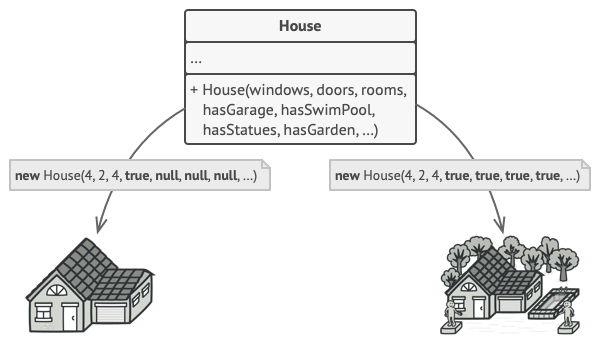
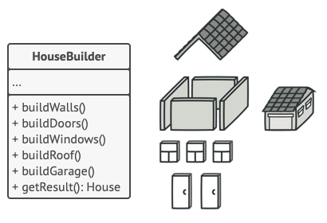
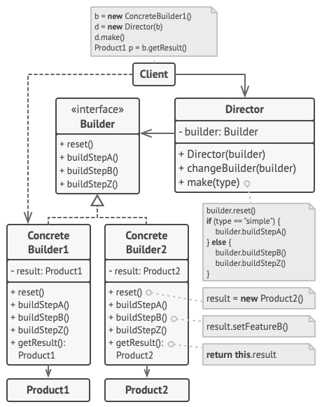

Banner Source: https://refactoring.guru/design-patterns

# Definition
> [Builder](https://en.wikipedia.org/wiki/Builder_pattern) is a creational design pattern that lets you construct complex objects step by step. The pattern allows you to produce different types and representations of an object using the same construction code.

## Analogy
Mỗi căn nhà đơn giản đều có bốn bức tường, sàn nhà, mái nhà, etc. Xây một căn nhà như thế sẽ tốn rất nhiều công sức và vật liệu, chưa kể mỗi căn nhà đều có thêm nhiều decoration khác chẳng hạn như cây hoa lá cành, hồ cá, tượng waifu... à nhầm tượng lân sư.

Các thành phần của căn nhà:

```cpp
class Wall {
private:
	string _material;
	string _color;

public:
	Wall(string, string);
};

class Roof {
private:
	string _material;
	string _color;

public:
	Roof(string, string);
};

class Floor {
private:
	string _material;
	string _color;

public:
	Floor(string, string);
};
```

Căn nhà hoàn chỉnh: 

```cpp
class House{
private:
	Wall _wall;
	Roof _roof;
	Floor _floor;

public:
	House(Wall wall, Roof roof, Floor floor);
};
```

Có thể thấy, constructor của căn nhà chứa rất nhiều tham số và có thể phình to ra hơn nữa trong tương lai vì căn nhà vốn không phải là một thực thể đơn giản. Trong trường hợp căn nhà có thêm những decoration khác, chúng ta sẽ cần tạo thêm một constructor khác với nhiều tham số hơn:

```cpp
class House{
public:
	House(Wall wall, Roof roof, Floor floor);
	House(Wall wall, Roof roof, Floor floor, Tree tree, Statue statue);
	...
};
```

Điều này tạo ra một vấn đề, gọi là **Telescoping Constructor** (các constructor cứ nối nhau kéo dài ra, trông giống như một cái ống nhòm).  Việc có quá nhiều constructor làm cho chúng ta bối rối khi chọn constructor giữa một rừng constructor tương tự nhau.

Chúng ta có thể gom tất cả constructor lại thành một hàm tạo duy nhất:

```cpp
class House{
public:
	// Super Ultimate Constructor
	House(Wall wall, Roof roof, Floor floor, Tree tree, Statue statue, etc...);
};
```

Nếu tham số nào không sử dụng thì ta có thể truyền NULL. Tuy nhiên, điều này làm cho constructor sở hữu số lượng tham số khổng lồ, có thể gây ra việc nhầm lẫn thứ tự tham số. Hơn thế nữa, cách làm này lãng phí tham số khi không sử dụng.



Tồn tại một giải pháp mà chúng ta nghĩ ngay đến là xây dựng các class dẫn xuất extends từ base class. 

```cpp
class House{
public:
	House(Wall wall, Roof roof, Floor floor);
};

class WjbuHouse : public House{
public:
	House(Wall wall, Roof roof, Floor floor, Tree sakuraTree, Statue waifuStatue);
};

class StreamerHouse : public House{
	House(Wall wall, Roof roof, Floor floor, SpecialRoom gamingRoom, SpecialRoom studio);
};
```

Nhưng rồi đến một lúc nào đó, số lượng subclasses sẽ vượt ra khỏi giới hạn cho phép và không thể kiểm soát được 😥. 

## Solution
Thế nên, để giải quyết tình trạng trên, tôi xin giới thiệu bộ công pháp vang danh khắp chốn giang hồ: **Builder Design pattern**.

Công pháp này nói rằng, ta cần tổ chức constructor của object thành nhiều thành phần nhỏ dễ quản lý. Khi làm như vậy, chúng ta có thể extend những thuộc tính này tùy thích trong builder class. 



```cpp
class Builder{
public:
	Wall buildWall()
	{
		Wall wall("Rock", "White");
		return wall;
	}

	Roof buildRoof()
	{
		Roof roof("Brick", "Blue");
		return roof;
	}

	Floor buildFloor()
	{
		Floor floor("Granite", "Black");
	}
};

Builder builder;
House house;

house.setWall(builder.buildWall())
	.setRoof(builder->buildRoof());
	.setFloor(builder->buildFloor()); // Setter return building object.
```

Đôi khi vài bước xây dựng sẽ khác nhau đối với những loại căn nhà khác nhau. Chẳng hạn, các tòa lâu đài xa hoa thì lót sàn bằng thạch anh tím, còn căn chòi của các mụ phù thủy thì lại lót bằng hắc diện thạch.

Trong trường hợp đó, các builder lại phân ra thành nhiều loại khác nhau, dù chung các bước xây dựng ngôi nhà, nhưng cách implement là khác nhau. 

```cpp
// Concrete Builder
class CastleBuilder{
public:
	Wall buildWall();
	Roof buildRoof();
	Floor buildFloor() {
		return Floor("Quartz", "Purple");
	}
};

// Concrete Builder
class ShantyBuilder{
public:
	Wall buildWall();
	Roof buildRoof();
	Floor buildFloor() {
		return Floor("Obsidian", "Black");
	}
};
```

Thông thường, tổ đội thi công builder phải có một thằng director để dìu dắt bọn chúng. Điều này đòi hỏi ta cần tạo ra một class gọi là **Director**, có nhiệm vụ gọi các bước thực hiện công việc có trong builder class. Tuy nhiên, thằng director này chỉ là optional, có thể gọi trực tiếp các bước xây dựng từ client code. 

```cpp
class Director{
public:
	House build()
	{
		Builder builder;
		House house;
		
		house.setWall(builder->buildWall());
		house.setRoof(builder->buildRoof());
		house.setFloor(builder->buildFloor());
		
		return house;
	}
};

Director director;
House house = director.build();
```

Ngoài ra, director sẽ giấu tất cả các bước thực hiện của builder khỏi client.

# Implementation
## UML


- Bước 1: Xây dựng Builder Interface khai báo tất cả các bước để contruct một product (product ở đây là `House`). Builder Interface là optional.
- Bước 2: Cung cấp các implementations khác nhau của giao diện đã xây dựng. Nói ngắn gọn, ta đi xây dựng các Concrete Builder.
- Bước 3: Xây dựng các Product Class, là các class đầu ra mong muốn khi dùng Builder Pattern.
- Bước 4: Định nghĩa một class Director để gọi các bước bên phía giao diện, director là optional.

## With Director
**Code**
Builder Interface:

```cpp
// Builder interface
class Builder
{
public:
	virtual Wall buildWall() = 0;
	virtual Roof buildRoof() = 0;
	virtual Floor buildFloor() = 0;
};
```

Implement cho interface bằng các Concrete Builder:

```cpp
class CastleBuilder : public Builder{
public:
	Wall buildWall();
	Roof buildRoof();
	Floor buildFloor() {
		return Floor("Quartz", "Purple");
	}
};

class ShantyBuilder : public Builder {
public:
	Wall buildWall();
	Roof buildRoof();
	Floor buildFloor() {
		return Floor("Obsidian", "Black");
	}
};
```

Product Class:

```cpp
class House {
private:
	Wall _wall;
	Roof _roof;
	Floor _floor;
	
public:
	void setWall(Wall wall) { _wall = wall; }
	void setRoof(Roof roof) { _roof = roof; }
	void setFloor(Floor floor) { _floor = floor; }

	void specifications() {
		cout << "Wall: " << _wall._material << endl;
		cout << "Roof: " << _roof._material << endl;
		cout << "Floor: " << _floor._material << endl;
	}
};
```

Director:
```cpp
class Director {
private:
	// Can not creat object of astract class
	// so we use pointer
	Builder* _builder;
	
public:
	Director()
	{
		_builder = nullptr;
	}
	
	void setBuilder(Builder* newBuilder)
	{
		_builder = newBuilder;
	}

	House buildHouseWithoutFloor()
	{
		House house;
		house.setWall(_builder->buildWall());
		house.setRoof(_builder->buildRoof());
		return house;
	}

	House buildFullHouse()
	{
		House house;
		house.setWall(_builder->buildWall());
		house.setRoof(_builder->buildRoof());
		house.setFloor(_builder->buildFloor());
		return house;
	}
};
```

**Test**
```cpp
// Final product
House house; 

// Director who controls the process
Director director;

// Concrete Builder or Blue print of house
CastleBuilder castleBuilder;
ShantyBuilder shantyBuilder;

// Build a castle
cout << "---- Castle ----\n";
director.setBuilder(&castleBuilder);
house = director.buildFullHouse();
house.specifications();

// Build a shanty
cout << "---- Shanty ----\n";
director.setBuilder(&shantyBuilder);
house = director.buildHouseWithoutFloor();
house.specifications();
```

```ad-important
Builder không nhất thiết phải sử dụng Interface.
```

## Without Director
Đối với cách implement này, ta sẽ cài đặt thêm hàm `buildHouse` cho giao diện. Thay vì dùng Director implement hàm `buildFullHouse` gọi từng bước của builder, ta sử dụng Factory Pattern để tạo ra nhà máy và gọi hàm `buildHouse` dựa trên tham số tùy chọn.

**Code**
Giao diện builder có thêm hàm `buildHouse`.
```cpp
// Builder interface
class Builder
{
public:
	virtual Wall buildWall() = 0;
	virtual Roof buildRoof() = 0;
	virtual Floor buildFloor() = 0;

	// Use when we don't need director
	virtual House buildHouse() = 0;
};
```

Các Concrete Builder Class cần phải implement hàm `buildHouse` này
```cpp

// Concrete Builder
class CastleBuilder : public Builder
{
public:
	Wall buildWall();
	Roof buildRoof();
	Floor buildFloor();
	House buildHouse(){
		House house;
		
		house.setWall(buildWall());
		house.setRoof(buildRoof());
		house.setFloor(buildFloor());
		
		return house;
	}
};
```

Tương tự đối với `ShantyBuilder`. Tiếp theo, ta cần xây dựng nhà máy để tạo ra các object từ tùy chọn cho trước:
```cpp
enum HouseType {
	CASTLE_BUILDER,
	SHANTY_BUILDER
};

class HouseFactory
{
private:
	vector<Builder*> _builders;
public:
	HouseFactory()
	{
		// Pre-built houses
		_builders.push_back(new CastleBuilder());
		_builders.push_back(new ShantyBuilder());
	}

	House createHouse(int type)
	{
		return _builders[type]->buildHouse();
	}
};
```

**Test**
```cpp
// Factory for creating house
HouseFactory factory;

// Build a castle
cout << "---- Castle ----\n";
House castle = factory.createHouse(HouseType::CASTLE_BUILDER);
castle.specifications();

// Build a shanty house
cout << "---- Shanty ----\n";
House lakeView = factory.createHouse(HouseType::SHANTY_BUILDER);
lakeView.specifications();
```

# Use Cases
Sử dụng builder:
- Khi muốn code có thể tạo ra nhiều thể hiện khác nhau của sản phẩm. Chẳng hạn nhà bằng gỗ và nhà bằng đá.
- Khi muốn loại bỏ "telescopic constructor". Minh họa:
	```cpp
	class Pizza {
	    Pizza(int size) { ... }
	    Pizza(int size, boolean cheese) { ... }
	    Pizza(int size, boolean cheese, boolean pepperoni) { ... }
	    // ...
	};
	```
