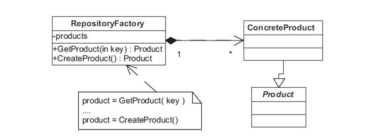

Banner Source: https://refactoring.guru/design-patterns

# Definition
> [**Factory Method Pattern**](https://en.wikipedia.org/wiki/Factory_method_pattern) says that just define an interface or abstract class for creating an object but let the subclasses decide which class to instantiate.

## Analogy
Giả sử có một anh Dev may mắn sở hữu chiếc MacBook được công ty phát cho để code ra những dòng code thần thánh. Ta sẽ mô hình hóa như sau:

```cpp
MacBook* laptop = new MacBook();
```

Thế nhưng, anh chàng này vốn là một người lăng nhăng. Vào một hôm trăng thanh gió mát nọ, anh lén chiếc MacBook ở nhà để đi ra ngoài mua con Legion 5 quốc dân.

```cpp
LegionFive* laptop = new LegionFive();
```

Đúng là một người đào hoa, trong lúc đi công tác, anh đồng thời cũng làm quen được một em MSI laptop chip Inteo cực hút điện. Dẫu vậy, chàng ta vẫn thích, gu mặn thật đấy!

```cpp
MSI* laptop = new MSI();
```

Có thể thấy, cùng là laptop mà ta lại phải tạo gọi ba constructor của ba class khác nhau.

Trong tương lai, anh chàng này có thể thay laptop tiếp, vì vậy chúng ta phải tạo ra một method dùng chung để gọi `n` constructor còn lại.

## Solution
Lúc này, ta sẽ sử dụng **Factory Method Pattern**. 

Chúng ta thay thế direct constructor thành một factory method dùng chung.

# Class Diagram


Trong hai giản đồ trên, `Manipulator` và `Conection` là hai Interface/Abstract Class. Còn `Figure` và `DbConnectionFactory` là hai Creator Class. 

# Implementation
## Abstract Class
Để gom nhóm các class có dùng chung một số thuộc tính, ta ứng dụng [[Polymorphism]] và xây dựng một base class (`Laptop`) chung để handle các derived class (`MacBook`, `LegionFive`, `MSI`).

Nhằm bắt buộc các phương thức của lớp con phải được implement, ta cần ứng dụng [[Abstraction]] và tạo ra một **Abstract Class** hay còn gọi là một **Interface** bằng cách biến các hàm trong `Laptop` thành thuần ảo.

```cpp
class Laptop {
	virtual string description() = 0;
};
```

Implement đối với mỗi class:

```cpp
class MacBook : Laptop {
	string description() {
		return "MacBook";
	}
};

class LegionFive : Laptop {
	string description() {
		return "LegionFive";
	}
};

class MSI : Laptop {
	string description() {
		return "MSI";
	}
};
```

## Instance Type
Có nhiều cách để phân biệt các loại instance, chẳng hạn ta phân biệt bằng cách truyền vào hàm tạo một chuỗi đại diện cho loại instance ta cần tạo. Với MacBook sẽ là `"macbook"`, Legion 5 là `"legion_five"`, etc.

Ngoài ra, ta có thể sử dụng kiểu `enum` (hiểu đơn giản là kiểu liệt kê).

```cpp
enum eLaptopType {
	LAPTOP_TYPE_MACBOOK,
	LAPTOP_TYPE_LEGIONFIVE,
	LAPTOP_TYPE_MSI,
	LAPTOP_TYPE_DEFAULT
};
```

Giá trị của các danh từ bên trong khai báo enum được gán mặc định và tăng dần, bắt đầu từ 0. Tuy nhiên, ta cũng có thể customize lại giá trị của nó bắng toán tử gán bằng

Có thể hiểu đoạn code trên tương tự việc chúng ta define nhiều macro liên tục:

```cpp
#define LAPTOP_TYPE_MACBOOK 0;
#define LAPTOP_TYPE_LEGIONFIVE 1;
#define LAPTOP_TYPE_MSI 2;
#define LAPTOP_TYPE_DEFAULT 3; 
```

Bản chất của chúng là các macro, do đó chúng sẽ không tạo ra vùng nhớ để chứa các giá trị. Chỉ khi nào sử dụng đến thì các giá trị mới được thay vào nơi gọi macro. Có thể tham khảo thêm ở bài [[MIPS Assembly Introduction]] của môn học Hệ thống máy tính.

## Factory Class
Sau cùng, ta tạo một class đại diện cho một cái nhà máy, hay còn gọi là **Creator Class**. Đồng thời tạo ra một static factory method để sản sinh ra những instance thuộc nhiều loại laptop khác nhau.

```cpp
class LaptopFactory {
public:
	static Laptop* createLaptop(int type);
};
```

Implement cho `createLaptop`:

```cpp
Laptop* LaptopFactory::createLaptop(int type)
{
	switch (type) {
	case LAPTOP_TYPE_MACBOOK:
		return new MacBook();
	case LAPTOP_TYPE_LEGIONFIVE:
		return new LegionFive();
	case LAPTOP_TYPE_MSI:
		return new MSI();
	default:
		return new MacBook(); // default is MacBook
	}
}
```

**Test**
```cpp
int main()
{
	Laptop* macbookLaptop = LaptopFactory::createLaptop(0);
	cout << macbookLaptop->description() << endl;
	Laptop* legionLaptop = LaptopFactory::createLaptop(1);
	cout << legionLaptop->description() << endl;
	Laptop* msiLaptop = LaptopFactory::createLaptop(2);
	cout << msiLaptop->description() << endl;
	return 0;
}
```

**Output**
```bat
MacBook
LegionFive
MSI
```

## Repository Factory
Ba bước trên là để tạo ra một Creator Class quản lý việc khởi tạo của duy nhất một instance. Trong trường hợp vừa muốn quản lý việc khởi tạo và cả lưu trữ, ta sử dụng Repository Factory. 

Repository Factory Class có thuộc tính là một danh sách các instance. Ngoài factory method thì nó còn có thêm một phương thức để lấy ra instance từ danh sách dựa vào `key` cho trước.



```ad-tip
Lớp Factory của một giao diện cụ thể thường được dùng đi dùng lại. Vì thế, chúng ta nên cài đặt [[Singleton]] cho lớp này.
```

# Use Cases
- Có thể nói, chúng ta sử dụng Factory Method Pattern khi có không biết derived class được tạo ra là class nào. 
- Đồng thời muốn chọn cách mà derived class được tạo ta thông qua base class. 

