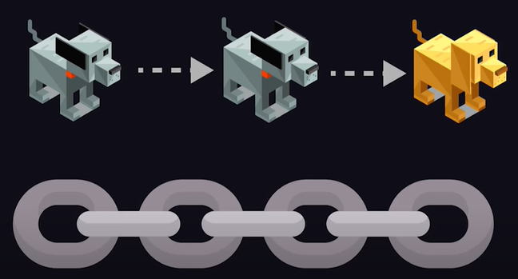
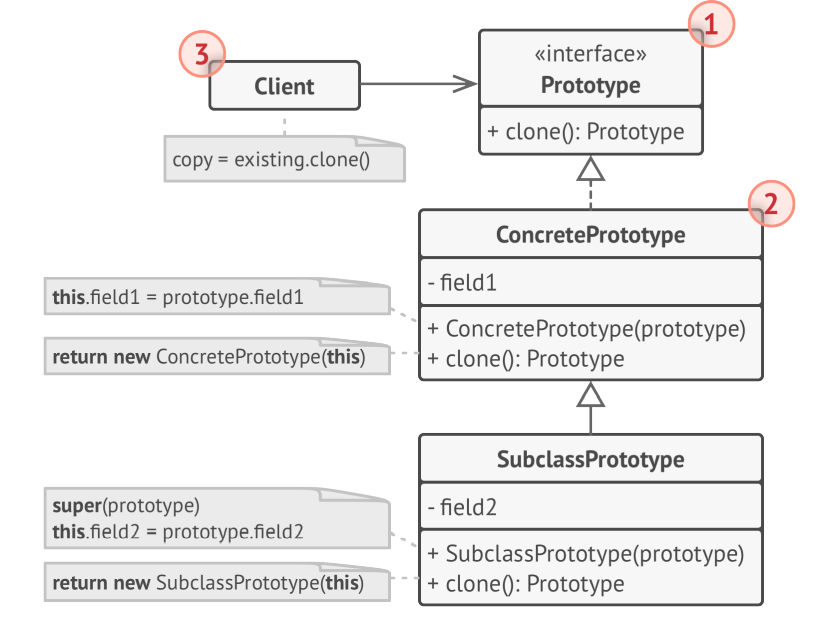
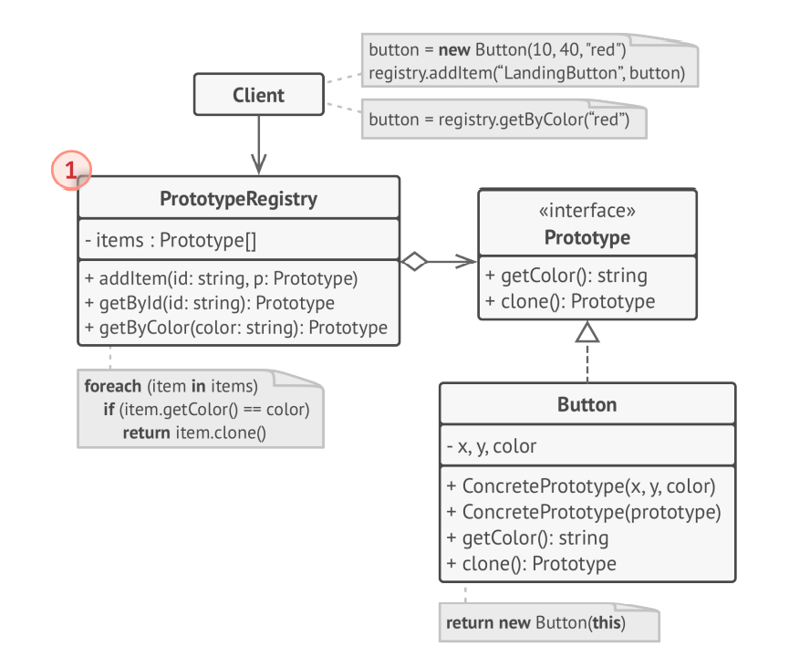

Banner Source: https://refactoring.guru/design-patterns

# Definition
> [**Prototype**](https://en.wikipedia.org/wiki/Prototype_pattern) is a creational design pattern that lets you copy existing objects without making your code dependent on their classes.

## Analogy
Giả sử chúng ta là một anh chàng may mắn được bố mẹ lì xì cho một chiếc Gaming PC khủng chỉ để "học online". 

```cpp
class SomeTypeOfPC{
private:
	string _cpu;
	string _vga;
	int _ram;
	int _ssd;
	int _power;
};

SomeTypeOfPC myPC;
```

Tuy nhiên, thằng em họ của chúng ta thì sắp đến nhà chơi nhân dịp tết đến xuân về. Và ai cũng biết nếu không đưa cho thằng quỷ nhỏ bất thứ gì thì chúng ta cũng không còn thứ gì. Gia chủ bèn nghĩ cách tặng thằng nhỏ một chiếc PC tương tự để nó tập luyện 300 bài code thiếu nhi cho nên người. 

Giải pháp mà chúng ta nghĩ ngay đến là mua từng linh kiện riêng lẻ về lắp rồi custom theo ý cu cậu:

```cpp
SomeTypeOfPC brotherPC;

brotherPC.setCPU(string newCPU);
brotherPC.setVGA(string newVGA);
brotherPC.setRAM(int memory);
brotherPC.setSSD(int memory);
brotherPC.setPower(int power);
```

Tuy nhiên, việc mua linh kiện và lắp ráp lại quá tốn thời gian và công sức. 

Thậm chí, chúng ta còn có thể không nhớ được phân loại của chiếc PC mà chúng đang sử dụng:

```cpp
ForgottenTypeOfPC brotherPC;

brotherPC.setCPU(string newCPU);
brotherPC.setVGA(string newVGA);
...
```

Điều này làm client code (code chỉ gọi sử dụng các object/instance mà không quan tâm đến cách object/instance được khởi tạo như thế nào) trở nên phụ thuộc vào class (phải nhớ tên class thì mới gọi constructor được).

## Solution
Để giải quyết vấn đề này, chúng ta mua hẳn một con PC build sẵn rồi về tự custom thỏa thích. Giả sử thằng em của chúng ta muốn CPU **AMD Ryzen 9 5900X** và VGA **RTX 3090**:

```cpp
UnknownTypeOfPC prototypePC;

PC* brotherPC = prototypePC.clone();
brotherPC.setCPU("AMD Ryzen 9 5900X");
brotherPC.setVGA("RTX 3090");
```

Cách làm này sẽ giải quyết hai vấn đề:
1. Giảm thiểu được việc xây dựng lại một đối tượng tốn kém chi phí (mua từng linh kiện về lắp).
2. Không cần biết class của đối tượng cũng có thể tạo ra một đối tượng mới (`PC` là base class và cũng là interface).

Việc copy một đối tượng được xây dựng sẵn gọi là **Prototype Design Pattern**. Pattern này sẽ định nghĩa ra các interface chung nhất cho tất cả các object hỗ trợ cloning.

Một object mà hỗ trợ cloning thì được gọi là prototype (bản thân một clone object có thể được clone tiếp). 



Image Source: [Fireship](https://www.youtube.com/channel/UCsBjURrPoezykLs9EqgamOA)

# Implementation
## Basic Implementation
**Diagram**


**Steps**
- Bước 1: xây dựng một inteface/abstract class (`PC`) để giao tiếp với client. Thông thường, interface này chỉ chứa mỗi phương thức `clone`.
- Bước 2: Xây dựng các **Concrete Prototype** (`GamingPC`) chứa implement cho hàm clone ở interface.
- Bước 3: Một client có thể tạo ra một bản copy mà có tuân thủ prototype interface, hay nói cách khác là object đó clonable.

**Code**
```cpp
// Prototype Interface, client can see this one.
class PC {
public:
	virtual PC* clone() = 0;
	virtual void description() = 0;
};

// Concreate Prototype, client can not see this one
class GamingPC : public PC{
public:
	void description(){
		cout << "This is Gaming PC\n";
	}
	
	PC* clone(){
		return new GamingPC(*this);
	}
};

class WorkingPC : public PC {
public:
	void description(){
		cout << "This is Working PC\n";
	}
	
	PC* clone(){
		return new WorkingPC(*this);
	}
};
```

## Registry Implementation
**Diagram**




Ở cách implement này, ta xây dựng thêm một class ứng dụng [[Factory]] gọi là **Prototype Registry**. Prototype Registry cung cấp một cách dễ tiếp cận cho các class thường sử dụng. Nó chứa sẵn một danh sách các pre-built objects sẵn sàng để được clone. 

**Code**
```cpp
enum ePCType {
	GAMING_PC,
	WORKING_PC
};

class PCPrototypeFactory {
private:
	vector<PC*> _prototypes;
public:
	PCPrototypeFactory()
	{
		// Pre-built object ready for cloning
		_prototypes.push_back(new GamingPC);
		_prototypes.push_back(new WorkingPC);
	}
	PC* createPC(int type)
	{
		return _prototypes[type]->clone();
	}
};
```

Registry Implementation chỉ là optional. Ta có thể clone trực tiếp các object ở trên nếu muốn.

**Test**
```cpp
PCPrototypeFactory pcMaker;

// Create one instance from factory
PC* pc = pcMaker.createPC(1);
cout << "Type of PC: " << typeid(*pc).name() << endl; // class WorkingPC 

// Start to clone it :D 
PC* newPC = pc->clone();
cout << "Type of PC: " << typeid(*newPC).name() << endl; // class WorkingPC
```

# Usage
- Khi chi phí để tạo mới một object quá lớn.
- Khi chúng ta nhận object từ một bên thứ ba thông qua interface nào đó, đồng thời chúng ta không biết thông tin của Concrete Classes. Và chúng ta muốn code của mình không phụ thuộc vào bên thứ ba.
- Khi có quá nhiều class kế thừa phức tạp mà chỉ khác nhau bởi cách chúng khởi tạo và cấu hình.

> **Tổng kết**: Prototype design pattern allows you to create objects by **cloning** an existing object instead of creating a new object from scratch. This pattern is used when the process of **object creation is costly**. when cloning, the newly copied object contains the same characteristics as its source object. After cloning, we can change the values of the new object’s properties as required. This pattern comes under a **creational** pattern.
